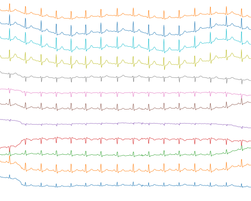
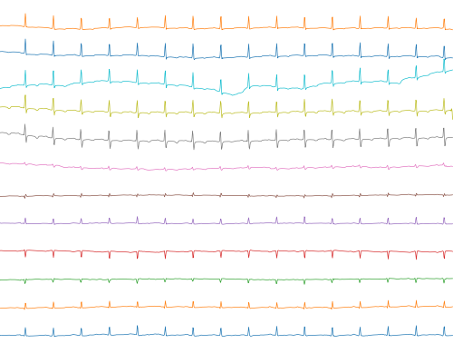

# CardioIA – Fase 2 | Ir Além 2: Diagnóstico visual de ECG com rede neural MLP

Rede neural **MLP (Perceptron Multicamadas)** em **Keras** que classifica imagens de eletrocardiograma (ECG) em **normal** ou **anormal**.

> Projeto acadêmico com dados públicos e anonimizados. O modelo não deve ser usado para decisões clínicas.

## Vídeo de demonstração

[Assista no YouTube](COLE_AQUI_O_LINK_DO_VIDEO_IR_ALEM_2)

## Arquivos

```text
ir-alem-2/
├── README.md
├── classificador_ecg_mlp.ipynb   # notebook completo, já executado
└── exemplos/                     # 3 ECGs normais e 3 anormais gerados pelo notebook
```

As 1.200 imagens usadas no treino não ficam no repositório. O notebook as gera na pasta `dados/`, que está no `.gitignore`.

## Dataset: por que PTB-XL?

O dataset sugerido no enunciado ([Kaggle – Heartbeat](https://www.kaggle.com/datasets/shayanfazeli/heartbeat)) **não contém imagens**: são arquivos CSV com 187 valores numéricos por batimento. Como a atividade pede classificação de imagens, usamos o **[PTB-XL](https://physionet.org/content/ptb-xl/1.0.3/)** (PhysioNet), a mesma base da [Fase 1](https://github.com/andrevgtoledo/CardioIA-Fase1). Ela é pública, não exige login e já tem diagnósticos revisados por cardiologistas.

| Classe | Critério | Exames |
|---|---|---|
| normal | única superclasse é **NORM** | 600 |
| anormal | tem **MI**, **STTC**, **CD** ou **HYP**, e não tem NORM | 600 |

## Pipeline

1. **Geração das imagens.** Reaproveita o código da Fase 1 com três correções:
   - **Sem título, eixos ou grade.** Na Fase 1 o título trazia o nome da classe: um *vazamento de rótulo* que deixaria a rede "ler" a resposta.
   - **Escala vertical fixa**, para preservar a amplitude do sinal, que é importante para detectar hipertrofia.
   - **Centralização de cada derivação** pela mediana.
2. **Pré-processamento.** Tons de cinza, redimensionamento para 128 × 128, normalização para 0–1 com inversão (traçado = 1, fundo = 0) e achatamento em um vetor de 16.384 posições.
3. **Divisão por paciente.** Folds oficiais do PTB-XL: 1 a 8 para treino (948 imagens), 9 para validação (130) e 10 para teste (122).
4. **MLP.** `Dense(256, relu) → Dropout(0.5) → Dense(64, relu) → Dropout(0.5) → Dense(1, sigmoid)`, com Adam (taxa de aprendizado 3e-5), entropia cruzada binária e *early stopping*.

<p align="center">
  
  
  <br><em>Esquerda: ECG normal. Direita: ECG anormal. 12 derivações empilhadas.</em>
</p>

## Resultados (conjunto de teste, 122 exames)

| Métrica | Resultado |
|---|---|
| **Acurácia** | **69,7%** |
| Recall normal | 80% |
| Recall anormal | 59% |
| Referência: responder sempre "normal" | 52% |

| Acerto por tipo de alteração | |
|---|---|
| CD – distúrbio de condução | 63% |
| STTC – alteração ST/T | 61% |
| MI – infarto | 56% |
| HYP – hipertrofia | 54% |

## Principais conclusões

- **O pré-processamento pesou mais que a rede.** Com a mesma rede e o mesmo treino, a escala automática da Fase 1 chegou a cerca de 65% de acurácia, e a escala fixa a cerca de 71% (média de 5 execuções). Mudar camadas e neurônios quase não alterou o resultado.
- **A taxa de aprendizado baixa estabilizou o treino.** Com o padrão (0,001), o resultado variava entre 64% e 73% só de trocar a semente aleatória. Com 0,00003, a variação ficou abaixo de 1 ponto.
- **Overfitting.** São 4,2 milhões de parâmetros para 948 imagens: o treino passa de 85% de acurácia, e a validação fica em cerca de 70%.
- **Limite da MLP.** Achatar a imagem destrói a noção de vizinhança entre pixels. O próximo passo natural é uma **CNN**, ou uma CNN 1D direto no sinal numérico.
- **Falsos negativos.** 4 em cada 10 ECGs anormais passaram como normais, o que é inaceitável em triagem sem revisão humana.
- **Viés.** O grupo anormal é 15 anos mais velho (69 contra 54) e tem menos mulheres (41% contra 53%). A rede pode estar aprendendo "ECG de idoso" em vez de "ECG alterado".

## Como executar

```bash
pip install -r ../requirements.txt
jupyter notebook classificador_ecg_mlp.ipynb
```

No Google Colab, rode `!pip install wfdb` antes da primeira célula. A primeira execução baixa cerca de 35 MB do PhysioNet e leva de 10 a 15 minutos. As execuções seguintes reaproveitam as imagens já geradas.

## Referência

Wagner, P. et al. *PTB-XL, a large publicly available electrocardiography dataset.* Scientific Data 7, 154 (2020). https://doi.org/10.1038/s41597-020-0495-6
